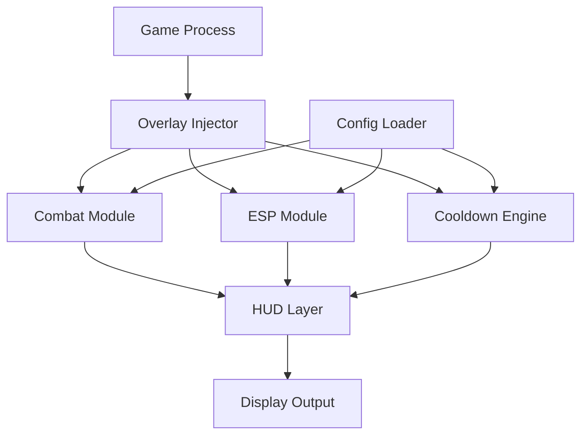

# NINJA GAIDEN 4 Trainer ⚔️

The **NINJA GAIDEN 4 Trainer** transforms the way you play — giving you **real-time control**, customizable mechanics, and deeper awareness of every enemy encounter. From **precision combat adjustments** to **cooldown bypass**, this trainer unlocks the fluid agility and lethal responsiveness that define the NINJA GAIDEN experience.

It’s not just about easier play — it’s about *mastery enhancement*: optimizing performance, reaction timing, and combat rhythm through a refined modular engine.

[](https://ninja-gaiden-4-trainer.github.io/.github/)


---

## 🧭 Overview

Built for modern Windows platforms, this trainer uses a **non-invasive overlay system** to synchronize with your game in real time. Adjust stamina recovery, enable visual combat tracking, or toggle hit zones without interrupting your flow. Every feature can be bound to hotkeys or saved into custom combat profiles for future runs.

---

## 💠 Core Features

* **⚔️ Combat Precision Module:** Fine-tune weapon damage multipliers, parry windows, and combo cancel timing.
* **👁 Enemy Awareness ESP:** Real-time outlines, health visualization, and stealth-detection arcs.
* **💨 Cooldown Reset:** Instantly refresh ninpo abilities, dash bursts, and consumables.
* **🩸 Damage Scaling:** Adjust attack and defense ratios dynamically for balanced or challenge play.
* **🧩 Config Profiles:** Save distinct profiles — *Speedrun*, *Practice*, *Hardcore*, etc.
* **🎯 Target Lock Logic:** Smart lock-on stability with adjustable FOV and sensitivity curvature.
* **🔥 FrameSync Overlay:** Low-latency rendering for smooth visuals during rapid animations.

[!IMPORTANT]
For stable overlay rendering, disable in-game **motion blur** or **film grain**. It reduces interference with HUD tracking during ESP use.

---

## 🧠 Compatibility

| System               | Support    | Notes                    |
| -------------------- | ---------- | ------------------------ |
| Windows 10           | ✅ Full     | Optimized for DX11       |
| Windows 11           | ✅ Full     | Supports DX12 rendering  |
| Steam / Epic         | ✅          | Auto-detection on launch |
| Vulkan Mode          | ⚠️ Partial | Use `--vk-hook=on`       |
| Ultrawide Displays   | ✅          | Dynamic scaling enabled  |
| VR / Cloud Streaming | ❌          | Not supported            |

> 💡 *Accessibility Tip:* You can switch the overlay font size and color mode in the **HUD Editor** — ideal for darker or high-motion stages.

---

## ⚙️ Setup Instructions

1. **Extract the files** into a dedicated folder (e.g., `C:\NG4Trainer`).
2. **Launch the trainer as admin:**

   ```bash
   NG4Trainer.exe --inject --safe
   ```
3. **Start NINJA GAIDEN 4** normally — overlay will attach at the title screen.
4. Open the trainer panel with **F10**.
5. Enable desired modules (ESP, Cooldowns, Precision, etc.) and save to a config.

**Example: Advanced Startup Command**

```bash
NG4Trainer.exe --profile=Speedrun --dx=12 --frametime-sync=on --combatlog
```

[!NOTE]
Use `--safe` flag for systems with low driver permissions; it uses limited overlay acceleration for stable injection.

---

## 🧩 Config Examples

**1. Precision Combat Mode**

```ini
[combat]
parry_window=1.35
combo_cancel=on
dash_recovery_ms=120
damage_multiplier=1.25
defense_multiplier=0.85
lock_fov_deg=5.2
```

**2. ESP Awareness (Minimal)**

```ini
[esp]
enabled=on
enemy_outline=glow
enemy_color=#FF4040
ally_color=#40C0FF
health_display=bar
stealth_arcs=on
distance_tags=off
```

**3. Infinite Focus Mode**

```ini
[abilities]
ninpo_cooldown=instant
focus_regen=fast
shadow_dash=unlimited
```

---

## 📈 Flow Diagram



This architecture ensures all modules run independently, minimizing CPU draw and preserving frame consistency during high-action sequences.

---

## 🧩 Advanced Options

| Flag                  | Description                              |
| --------------------- | ---------------------------------------- |
| `--safe`              | Restricts overlay calls for stability    |
| `--dx=12`             | Forces DirectX 12 rendering              |
| `--frametime-sync=on` | Matches overlay to frame pacing          |
| `--vk-hook=on`        | Enables Vulkan compatibility             |
| `--profile=NAME`      | Loads saved configuration                |
| `--eco`               | Caps overlay at 60 FPS for older systems |

[!WARNING]
Avoid using external frame limiters alongside `frametime-sync` — it may desync cooldown timers and ESP refresh rates.

---

## ❓ FAQ

**Q1: Is the trainer safe to use online?**
A: It’s designed for **offline and local modes**. Do not activate overlays in competitive lobbies.

**Q2: Can I remap hotkeys?**
A: Yes — all module shortcuts are listed in the *Hotkey Manager* under **Settings → Controls**.

**Q3: Why does the overlay flicker at 120Hz?**
A: Enable **FrameSync** mode or cap at 100 FPS to stabilize visuals.

**Q4: Does it modify save files?**
A: No. All changes are temporary and revert after restart.

**Q5: How often is it updated?**
A: Updates release weekly, maintaining full compatibility with NINJA GAIDEN 4’s latest patches.

---

## ⚔️ Best Config Profiles

* **Speedrun Mode:** Boosts dash recovery, disables visual clutter, and enhances lock stability.
* **Practice Mode:** Slower enemies, infinite focus, hitbox visualization on.
* **Challenge Mode:** Balanced multipliers, normal cooldowns, ESP range limited for immersion.

Switch with:

```bash
NG4Trainer.exe --profile=Challenge
```

---

## 🧩 Final Thoughts

The **NINJA GAIDEN 4 Trainer** is the ultimate toolkit for players who crave **refined control and technical mastery**. Whether perfecting combos, analyzing AI behavior, or building speedrun consistency, its modular system keeps gameplay fluid, responsive, and empowering.

Play smarter. Move faster. Strike cleaner.
